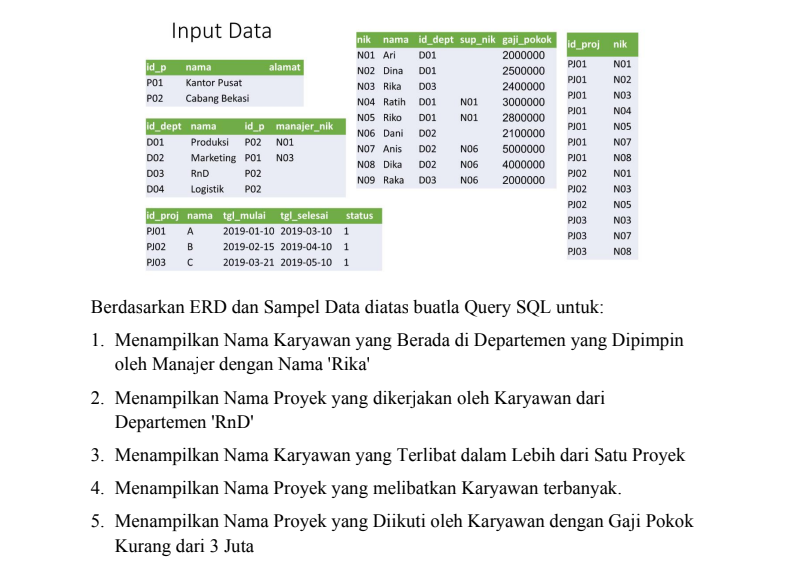
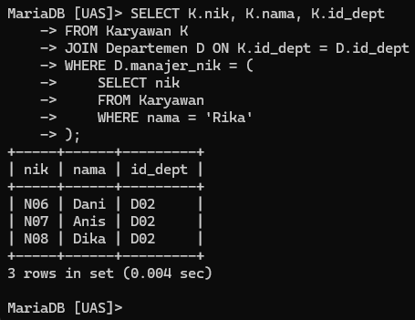
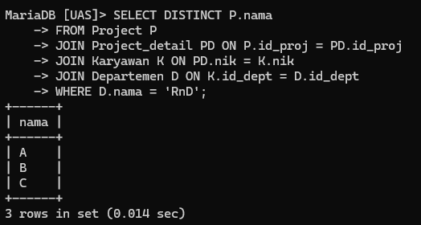
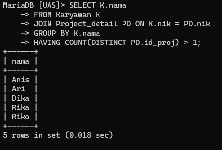
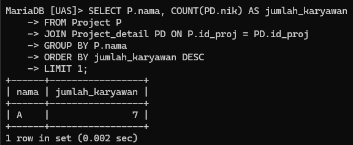
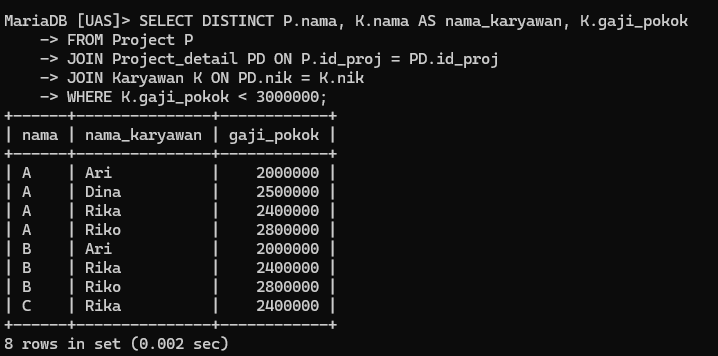

# Tugas UAS { Pertemuan ke 16 } 

| **Nama**            | **NIM**   | **Kelas** | **Matkul** |
| ------------------- | --------- | --------- | ---------- |
| Ahmad Ridho Septian | 312310447 | TI.23.A.5 | Basis Data |

# UAS

## Input Data dan Soal UAS



> **Keterangan** : Terdapat 5 tabel yang terdiri dari tabel Perusahaan, Departemen, Karyawan, Project dan Project Detail.

## Latihan Praktikum 7

### 1. Menampilkan Nama Karyawan yang Berada di Departemen yang Dipimpin oleh Manajer dengan Nama 'Rika'

**Script :**

```sql
SELECT DISTINCT P.id_proj, P.nama AS nama_proyek, K.id_dept, K.nama AS nama_karyawan
FROM Project P
JOIN Project_detail PD ON P.id_proj = PD.id_proj
JOIN Karyawan K ON PD.nik = K.nik
JOIN Departemen D ON K.id_dept = D.id_dept
WHERE D.nama = 'RnD';

```

**Output :**



### 2. Menampilkan Nama Proyek yang dikerjakan oleh Karyawan dari Departemen 'RnD'

**Script :**

```sql
SELECT DISTINCT P.nama
FROM Project P
JOIN Project_detail PD ON P.id_proj = PD.id_proj
JOIN Karyawan K ON PD.nik = K.nik
JOIN Departemen D ON K.id_dept = D.id_dept
WHERE D.nama = 'RnD';

```

**Output :**



### 3. Menampilkan Nama Karyawan yang Terlibat dalam Lebih dari Satu Proyek

**Script :**

```sql
SELECT K.nama
FROM Karyawan K
JOIN Project_detail PD ON K.nik = PD.nik
GROUP BY K.nama
HAVING COUNT(DISTINCT PD.id_proj) > 1;
```

**Output :**



### 4. Menampilkan Nama Proyek yang melibatkan Karyawan terbanyak.

**Script :**

```sql
SELECT P.nama, COUNT(PD.nik) AS jumlah_karyawan
FROM Project P
JOIN Project_detail PD ON P.id_proj = PD.id_proj
GROUP BY P.nama
ORDER BY jumlah_karyawan DESC
LIMIT 1;

```

**Output :**



### 5. Menampilkan Nama Proyek yang Diikuti oleh Karyawan dengan Gaji Pokok Kurang dari 3 Juta

**Script :**

```sql
SELECT DISTINCT P.nama, K.nama AS nama_karyawan, K.gaji_pokok
FROM Project P
JOIN Project_detail PD ON P.id_proj = PD.id_proj
JOIN Karyawan K ON PD.nik = K.nik
WHERE K.gaji_pokok < 3000000;
```

**Output :**


